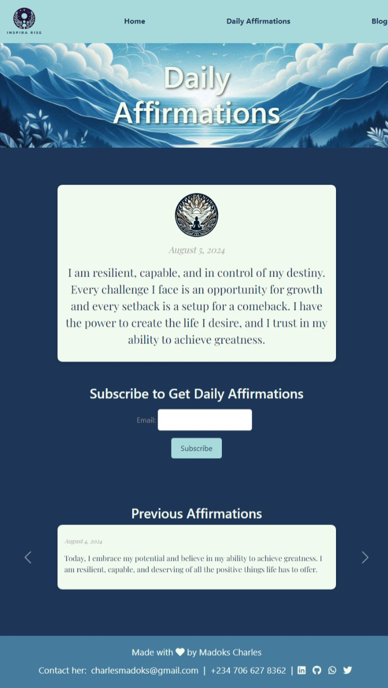

# InspiraRise

Welcome to **InspiraRise**! This project is a beautifully designed platform that provides daily affirmations, motivational quotes, and insightful blog posts to inspire and uplift users.


## Table of Contents

- [Introduction](#introduction)
- [Features](#features)
- [Technologies Used](#technologies-used)
- [Screenshots](#screenshots)
- [Setup and Installation](#setup-and-installation)
- [Usage](#usage)
- [Contributing](#contributing)
- [Author](#Author)
- [Contact](#contact)

## Introduction

InspiraRise is your go-to source for daily motivation. Whether you need a positive affirmation to start your day, a quote to keep you going, or a blog post to provide deeper insights, InspiraRise has got you covered.

## Features

- **Daily Affirmations**: Receive a new affirmation every day to boost your mood and confidence.
- **Motivational Quotes**: Explore a vast collection of quotes categorized by themes.
- **Blog Posts**: Read engaging and thoughtful blog posts on various topics.
- **Subscription**: Subscribe to get daily affirmations directly to your email.
- **Responsive Design**: Enjoy a seamless experience across all devices.

## Technologies Used

- **Django**: Backend framework for creating a robust web application.
- **HTML/CSS**: Frontend technologies for building the structure and styling of the web pages.
- **Bootstrap**: CSS framework for responsive and modern designs.
- **SQLite**: Database for storing affirmations, quotes, and blog posts.
- **Django REST Framework (DRF)**: API technology used to provide endpoints for generating quotes and info on authors.

## Screenshots

### Home Page


### Daily Affirmations


### Blog Page


## Setup and Installation

1. Clone the repository:
   ```bash
   git clone https://github.com/madokscharles/InspiraRise.git
   cd InspiraRise
   ```
2. Create a virtual environment and activate it:
    ```bash
   python -m venv venv
   source venv/bin/activate  # On Windows use `venv\Scripts\activate`
   ```
3. Install the required dependencies.
4. Apply migrations:
    ```bash
   python manage.py migrate
   ```
5. Create a superuser:
    ```bash
   python manage.py createsuperuser
   ```
6. Run the development server:
    ```bash
   python manage.py runserver
   ```
7. Open your browser and navigate to http://127.0.0.1:8000 to view the application.

## Usage

- **Home Page**: View a random motivational quote.
- **Daily Affirmations**: Get the daily affirmation and subscribe to receive them via email.
- **Blog**: Read insightful blog posts and explore various topics.

## Contributing

We welcome contributions from the community. Please follow these steps to contribute:

1. Fork the repository.
2. Create a new branch:
   ```bash
   git checkout -b feature/your-feature-name
   ```
3. Make your changes and commit them:
    ```bash
    git commit -m "Add your commit message"
    ```
4. Push to the branch:
    ```bash
    git push origin feature/your-feature-name
    ```
5. Create a Pull Request.

## Author

Madoks Charles - charlesmadoks@gmail.com

## Contact

Made with ❤️ by Madoks Charles.

- **Email**: charlesmadoks@gmail.com.